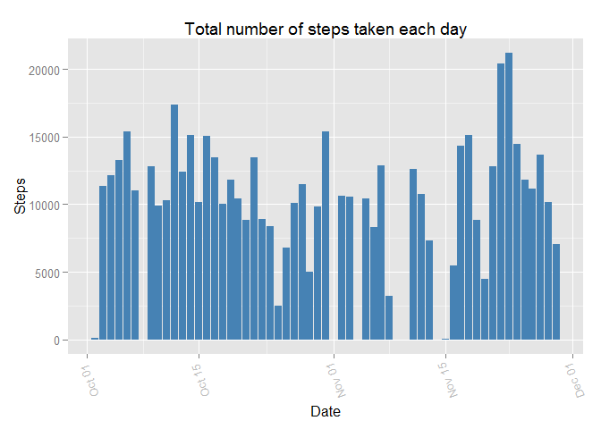
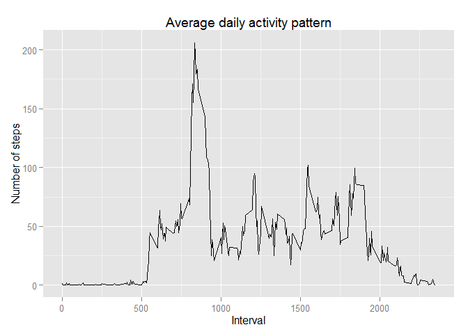
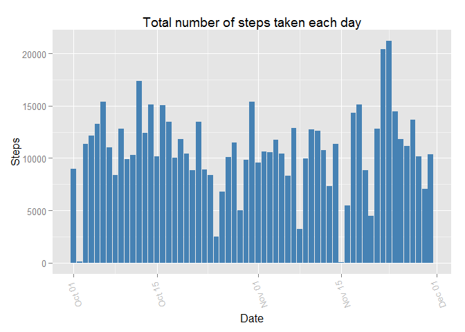
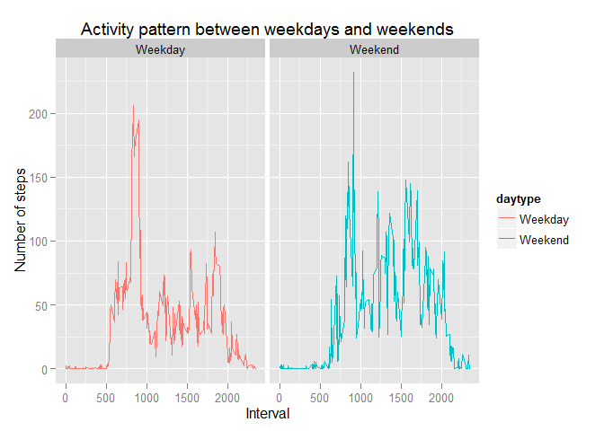

# Reproducible Research: Peer Assessment 1


```r
library(knitr)
knitr::opts_knit$set(echo = TRUE)
knitr::opts_knit$set(root.dir = "E:\\Coursera\\Reproducible_Research\\RepData_PeerAssessment1-master\\Data\\")
```


## Loading and preprocessing the data

```r
library(data.table)
amdata <- read.table("activity.csv", header = TRUE,sep=",",stringsAsFactors = FALSE)
head(amdata)
```

```
##   steps       date interval
## 1    NA 2012-10-01        0
## 2    NA 2012-10-01        5
## 3    NA 2012-10-01       10
## 4    NA 2012-10-01       15
## 5    NA 2012-10-01       20
## 6    NA 2012-10-01       25
```

### Structure of Activity Management Data

```r
str(amdata)
```

```
## 'data.frame':	17568 obs. of  3 variables:
##  $ steps   : int  NA NA NA NA NA NA NA NA NA NA ...
##  $ date    : chr  "2012-10-01" "2012-10-01" "2012-10-01" "2012-10-01" ...
##  $ interval: int  0 5 10 15 20 25 30 35 40 45 ...
```

### Convert date field to Date format

```r
amdata$date <- as.Date(amdata$date)
str(amdata)
```

```
## 'data.frame':	17568 obs. of  3 variables:
##  $ steps   : int  NA NA NA NA NA NA NA NA NA NA ...
##  $ date    : Date, format: "2012-10-01" "2012-10-01" ...
##  $ interval: int  0 5 10 15 20 25 30 35 40 45 ...
```

### Summary of Activity Data

```r
summary(amdata)
```

```
##      steps             date               interval     
##  Min.   :  0.00   Min.   :2012-10-01   Min.   :   0.0  
##  1st Qu.:  0.00   1st Qu.:2012-10-16   1st Qu.: 588.8  
##  Median :  0.00   Median :2012-10-31   Median :1177.5  
##  Mean   : 37.38   Mean   :2012-10-31   Mean   :1177.5  
##  3rd Qu.: 12.00   3rd Qu.:2012-11-15   3rd Qu.:1766.2  
##  Max.   :806.00   Max.   :2012-11-30   Max.   :2355.0  
##  NA's   :2304
```

## What is mean total number of steps taken per day?

## Daily total steps:

```r
library(dplyr)
```

```
## 
## Attaching package: 'dplyr'
```

```
## The following objects are masked from 'package:data.table':
## 
##     between, last
```

```
## The following objects are masked from 'package:stats':
## 
##     filter, lag
```

```
## The following objects are masked from 'package:base':
## 
##     intersect, setdiff, setequal, union
```

```r
library(ggplot2)
library(xtable)

daily_steps<- group_by(amdata, date)%>% summarise_each(funs(sum(steps, na.rm=TRUE))) %>% select("Date" = date, "Daily_total_steps"= steps)

kable(head(daily_steps))
```


Date          Daily_total_steps
-----------  ------------------
2012-10-01                    0
2012-10-02                  126
2012-10-03                11352
2012-10-04                12116
2012-10-05                13294
2012-10-06                15420

### Histogram of the total number of steps taken each day

```r
ggplot(amdata, aes(date, steps ))+geom_bar(stat="identity", fill="steelblue")+
  theme(axis.text.x = element_text(angle =110, vjust = .5, color = "gray")) + 
  xlab("Date") + 
  ylab("Steps") + 
  ggtitle("Total number of steps taken each day")
```

```
## Warning: Removed 2304 rows containing missing values (position_stack).
```

<!-- -->

### Average daily steps:

```r
daily_mean <- round(mean(daily_steps$Daily_total_steps, na.rm=TRUE))
```
Average daily steps: 9354

### Daily median steps:

```r
library(xtable)
daily_median_steps <- median(daily_steps$Daily_total_steps, na.rm=TRUE)
```
Daily median steps: 10395

## What is the average daily activity pattern?

```r
library(dplyr)
library(ggplot2)
interval_steps<- group_by(amdata, interval)%>% summarise_each(funs(mean(steps, na.rm=TRUE))) %>% select("Interval"=interval, "Average_steps"= steps)
max_interval_steps <- max(interval_steps$Average_steps, na.rm=TRUE)
max_interval <- interval_steps[which(interval_steps$Average_steps == max_interval_steps),]$Interval
ggplot(interval_steps, aes(x = Interval, y = Average_steps)) +
         geom_line()+
  xlab("Interval") + 
  ylab("Number of steps") + 
  ggtitle("Average daily activity pattern")
```

<!-- -->

5-minute Interval 835 has maximum number of steps: 206.1698113

## Imputing missing values
### Missing values will be imputed using mice package
1. m  - Refers to number of imputed data sets  
2. maxit - Refers to no. of iterations taken to impute missing values  
3. method - Refers to method used in imputation  
4. we will use (pmm) predictive mean matching as steps is a numeric variable  
5. We will adda a new variable (isteps- imputed steps) to amdata

```r
library(mice)
```

```
## Loading required package: Rcpp
```

```
## mice 2.25 2015-11-09
```

```r
amdata_miss <- select(amdata, c(1,3))  # only select numerical variables
am1 <- mice(amdata_miss, m=1, maxit = 5, method = 'pmm', seed = 500)
```

```
## 
##  iter imp variable
##   1   1  steps
##   2   1  steps
##   3   1  steps
##   4   1  steps
##   5   1  steps
```

```r
amdata_miss <- complete(am1,1)
amdata$isteps <- amdata_miss$steps
```

### Histogram of the total number of steps taken each day (with imputed vales for steps)

```r
ggplot(amdata, aes(date, isteps ))+geom_bar(stat="identity", fill="steelblue")+
  theme(axis.text.x = element_text(angle =110, vjust = .5, color = "gray")) + 
  xlab("Date") + 
  ylab("Steps") + 
  ggtitle("Total number of steps taken each day")
```

<!-- -->

### Average daily steps(with imputed values):

```r
daily_isteps<- group_by(amdata, date)%>% summarise_each(funs(sum(isteps, na.rm=TRUE))) %>% select("Date" = date, "Daily_total_steps"= isteps)
daily_imean <- round(mean(daily_steps$Daily_total_steps, na.rm=TRUE))
```
Average daily steps with imputation: 9354  
Average daily steps without imputation: 9354  

### Daily median steps:

```r
daily_median_isteps <- median(daily_steps$Daily_total_steps, na.rm=TRUE)
```
Daily median steps with imputation: 10395  
Daily median steps without imputation: 10395 

## Are there differences in activity patterns between weekdays and weekends?


```r
# Add one factor variable "daytype" to amdata
amdata$daytype <- ifelse(weekdays(amdata$date)=="Sunday"|weekdays(amdata$date) == "Saturday","Weekend","Weekday")
amdata$daytype <- as.factor(amdata$daytype)
interval_isteps<- group_by(amdata, interval,daytype)%>% summarise_each(funs(mean(isteps, na.rm=TRUE)))
```


```r
# Use ggplot2 to display a panal plot of time series
ggplot(interval_isteps, aes(x = interval, y = isteps, col = daytype)) +
  geom_line() + facet_grid( ~ daytype) +
  xlab("Interval") + 
  ylab("Number of steps") + 
  ggtitle("Activity pattern between weekdays and weekends")
```

<!-- -->

